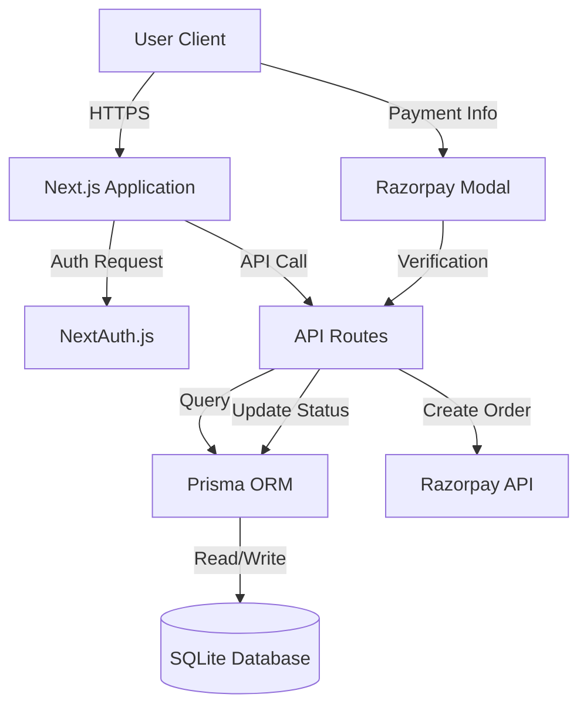

# Project Report: HopeConnect NGO Donation Platform

## 1. Executive Summary

The HopeConnect platform is a robust, full-stack web application designed for non-governmental organizations to streamline user registrations and donation management. The primary objective of the project was to create a system where user record-keeping is decoupled from payment processing, ensuring that donor information is captured and preserved regardless of whether a financial transaction is completed.

## 2. System Architecture & Technical Stack

The architecture follows a modern, scalable approach using the Next.js App Router, combining frontend and backend capabilities within a single, unified codebase.

### 2.1 Technical Specifications
-   **Framework**: Next.js 16 (App Router) - Utilized for its superior server-side rendering (SSR) and built-in API routing.
-   **Language**: TypeScript - Employed to ensure type safety across the entire application, reducing runtime errors and improving maintainability.
-   **Database**: SQLite (via Prisma ORM) - A file-based relational database chosen for its portability and simplicity during development and small-scale deployment.
-   **Authentication**: NextAuth.js - Handles secure user sessions with JSON Web Tokens (JWT) and BCrypt password hashing.
-   **Payments**: Razorpay Integrated - Provides a secure, PCI-compliant payment gateway using server-side order creation and signature verification.
-   **Styling**: Tailwind CSS & Lucide Icons - Used for creating a responsive, high-fidelity dark-themed user interface.

### 2.2 Conceptual Architecture Flow

## 3. Database Design & Data Integrity

A critical requirement was to ensure user data persistence independent of payment outcomes. The database schema satisfies this via a clear separation of entities.

### 3.1 Model Definitions

#### User Model
Stores registration and account details.
- `id`: CUID (Unique Identifier)
- `name`: Full Name
- `email`: Unique identifier for authentication.
- `password`: Hashed string for security.
- `role`: Authorization level (`USER` or `ADMIN`).
- `donations`: One-to-many relationship with the Donation model.

#### Donation Model
Stores individual transaction attempts.
- `id`: Unique Identifier.
- `amount`: Float value of the donation.
- `status`: Lifecycle states (`PENDING`, `SUCCESS`, `FAILED`).
- `currency`: Defaulted to "INR" for Razorpay integration.
- `stripeSessionId`: Stores the external Payment/Order ID for cross-referencing.

### 3.2 Integrity Rules
1.  **Independent Creation**: Users are created at `/register` before any donation is initiated.
2.  **State Persistence**: When a user initiates a donation, a `PENDING` record is created. This ensures the NGO has a record of the intent, allowing for follow-up if the payment is not completed.
3.  **Atomic Updates**: Status changes from `PENDING` to `SUCCESS` only occur after cryptographic verification from the payment provider.

## 4. Implementation Challenges & Solutions

### 4.1 Payment Amount Precision
**Challenge**: During the Razorpay integration, a mismatch was discovered where floating-point numbers in the currency (e.g., 10.50) caused the order creation to fail with an "Amount exceeded maximum" or "Invalid amount" error.
**Solution**: Implemented a strict normalization utility that parses the input and uses `Math.round(amount * 100)` to ensure Razorpay receives an exact integer in paise, eliminating rounding errors.

### 4.2 Security & Signature Verification
**Challenge**: Preventing users from spoofing successful payments by manually triggering the success API.
**Solution**: Implemented server-side signature verification. The API expects a `razorpay_signature` which is verified against the `order_id` and `payment_id` using a HMAC-SHA256 algorithm with the secret key.

## 5. User Features & Interface

### 5.1 Dynamic Dashboards
-   **User Dashboard**: Displays a comprehensive "Impact" summary. It calculates and aggregates only "SUCCESS" status donations to give the user an accurate representation of their contributions.
-   **Admin Dashboard**: Provides the NGO staff with a high-level overview of total funds raised and a complete list of all users and donation attempts, including pending ones.

### 5.2 Aesthetic Design
The platform utilizes a "Dark Premium" aesthetic with glassmorphism effects and vibrant gradients. This design choice aims to build trust and provide a professional appearance for the NGO.

## 6. Future Recommendations

1.  **Webhook Integration**: While client-side Verification is implemented, adding Stripe/Razorpay Webhooks would provide a fallback if a user closes their browser before the signature is verified.
2.  **Email Notifications**: Integration with an SMTP service (e.g., Resend or SendGrid) to send automated donation receipts.
3.  **Analytics**: Implementing a charting library (like Recharts) on the admin dashboard to visualize donation trends over time.

---
*Report Prepared for: NGO Donation Platform Project*
*Date: January 19, 2026*
