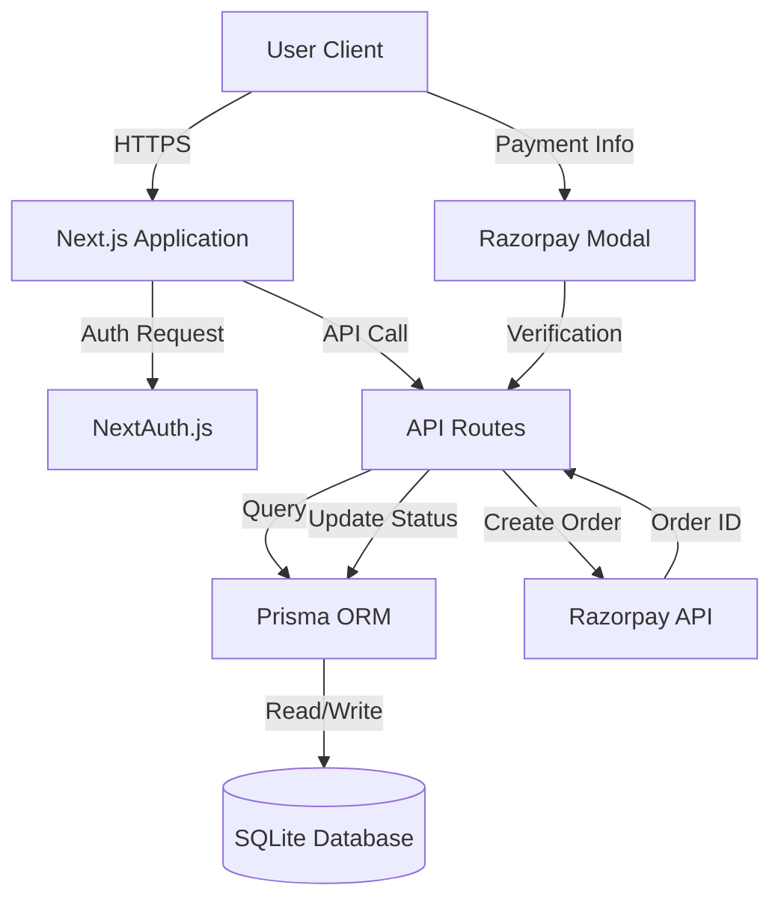

# Project Report: HopeConnect NGO Donation Platform

## 1. System Architecture

The HopeConnect platform is built using a modern, scalable web architecture designed to separate user registration data from donation processing, ensuring data integrity and allowing for independent management of users and payments.

### 1.1 Tech Stack
- **Frontend & Backend Framework**: Next.js 16 (App Router) - Provides server-side rendering, robust API routes, and secure server components.
- **Language**: TypeScript - Ensures type safety and code reliability.
- **Database**: SQLite (via Prisma ORM) - Lightweight, portable relational database for storing user and donation records.
- **Data Access Layer**: Prisma ORM - Type-safe database client.
- **Authentication**: NextAuth.js - Handles secure user sessions using Credentials provider (Email/Password) and JWT strategies.
- **Payments**: Razorpay (Test Mode) - Handles secure payment processing via Orders and Client-side Checkout.
- **Styling**: Tailwind CSS - Modern, responsive, and accessible UI design.

### 1.2 Architecture Diagram (Conceptual)

## 2. Database Schema

The database is designed to strictly separate `User` entities from `Donation` entities. A user exists independently of any donation.

### 2.1 Models

#### User
Stores registration information. Created immediately upon registration.
- **id**: Unique Identifier (CUID)
- **name**: User's full name
- **email**: Unique email address
- **password**: Hashed password (BCrypt)
- **role**: Authorization level (`USER` or `ADMIN`)
- **createdAt**: Timestamp of registration

#### Donation
Stores payment attempts and history. Linked to User but managed separately.
- **id**: Unique Identifier (CUID)
- **amount**: Donation amount in USD
- **status**: Payment state (`PENDING`, `SUCCESS`, `FAILED`)
- **stripeSessionId**: Reference to Razorpay Order ID (Note: Field name retained for schema stability)
- **userId**: Foreign Key linking to User
- **createdAt**: Timestamp of initiation

### 2.2 Data Integrity Rules
1.  **Independent Registration**: Users register via `/register`. This creates a `User` record. No donation is required to be a registered user.
2.  **Payment Tracking**: When a user clicks "Donate", a `Donation` record is created with status `PENDING`. This record persists even if the user closes the browser or the payment fails.
3.  **Role-Based Access**: Admins are distinguished by the `role` field, granting access to `/dashboard/admin`.

## 3. Key Design Decisions

### 3.1 Separation of Concerns
Registration and Donation flows are completely decoupled.
- **Registration**: `/register` -> API -> DB (User created).
- **Donation**: `/donate` -> API -> Razorpay Order.
This ensures that "user data is saved regardless of payment outcome" as required.

### 3.2 Secure Payment Handling
- **No storage of card details**: All sensitivity payment data is handled by Razorpay's secure modal.
- **Server-Side Order Creation**: Orders are created on the server to prevent amount manipulation.
- **Signature Verification**: Payment success is verified on the server using HMAC-SHA256 signature verification. This prevents "fake success" by forcing valid cryptographic proof from Razorpay.

### 3.3 Admin Visibility
Admins have a dedicated dashboard that aggregates data directly from the verified database records.
- **Total Donations**: Sum of only `SUCCESS` status donations.
- **User Management**: verification of registration data.

## 4. Payment Flow & Rules
1.  **Initiation**: User selects amount. System creates `PENDING` donation in DB and Razorpay Order.
2.  **Processing**: User completes payment via Razorpay Modal.
3.  **Completion**:
    *   **Success**: Razorpay returns success signature. API verifies signature. System updates DB status to `SUCCESS`.
    *   **Failure/Cancel**: User cancels. DB status remains `PENDING`.
4.  **Verification**: Admin sees the status in real-time.

## 5. Security Measures
- **Password Hashing**: BCrypt used for storing passwords.
- **Environment Variables**: API keys and secrets stored in `.env`.
- **Protected Routes**: Middleware and Server Session checks ensure only authenticated users access dashboards.
